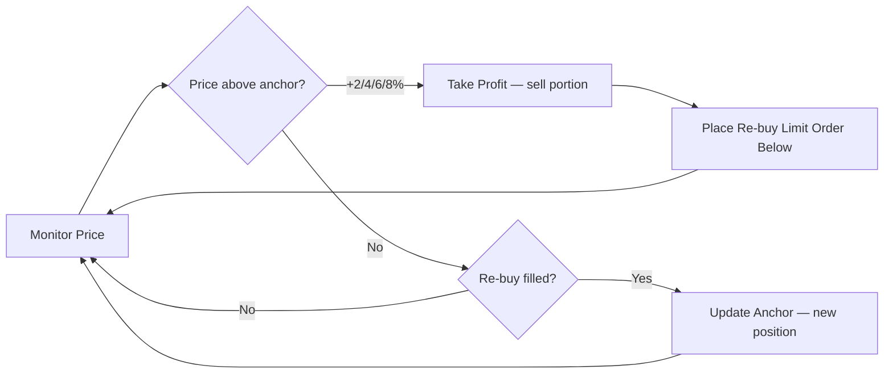

<div align="center">

```
⠀⠀⠀⠀⠀⠀⠀⠀⠀⠀⠀⠀⠀⠀⠀⠀⠀⠀⠀⠀⠀⠀⠀⠀⠀⠀⠀⠀⣠⣄⠀⠀⠀⠀⠀⠀⠀⠀⠀⠀⠀⠀⠀⠀⠀⠀⠀⠀⠀⠀⠀⠀⠀⠀⠀⠀⠀⠀
⠀⠀⠀⠀⠀⠀⠀⠀⠀⠀⠀⠀⠀⠀⠀⠀⠀⠀⠀⠀⠀⠀⠀⠀⠀⠀⣠⣾⣿⣿⠀⠀⠀⠀⠀⠀⠀⠀⠀⠀⠀⠀⠀⠀⠀⠀⠀⠀⠀⠀⠀⠀⠀⠀⠀⠀⠀⠀
⠀⠀⠀⠀⠀⠀⠀⠀⢀⣀⣀⣀⣀⣀⡀⠀⠀⠀⠀⠀⠀⠀⠀⠀⠀⣰⣿⣿⣿⣿⠀⠀⠀⠀⠀⠀⠀⠀⠀⠀⠀⠀⠀⠀⠀⠀⠀⠀⠀⠀⠀⠀⠀⠀⠀⠀⠀⠀
⢠⣾⣿⣏⠉⠉⠉⠉⠉⠉⢡⣶⡀⠀⠀⠀⠀⠀⠀⠀⠀⠀⠀⠀⠘⠻⢿⣿⣿⣿⡀⠀⠀⠀⠀⠀⠀⠀⠀⠀⠀⠀⠀⠀⠀⠀⠀⠀⠀⠀⠀⠀⠀⠀⢀⣤⡄⠀
⠈⣿⣿⣿⣿⣦⣽⣦⡀⠀⠀⠛⠁⠀⠀⠀⠀⠀⠀⠀⠀⠀⠀⠀⠀⠀⠀⠀⠉⠛⢧⡀⠀⠀⠀⠀⠀⠀⠀⠀⠀⠀⠀⠀⠀⠀⠀⠀⠀⠀⠀⠀⠀⣠⣿⣿⠀⠀
⠀⠘⢿⣿⣿⣿⣿⣿⣿⣦⣄⣀⠀⠀⠀⠀⠀⠀⠀⠀⠀⠀⠀⠀⠀⠀⠀⠀⠀⠀⠀⠀⠀⠀⠀⠀⠀⠀⠀⠀⠀⠀⠀⠀⠀⠀⠀⠀⠀⠀⠀⢀⣾⣿⣿⠇⠀⠀
⠀⠀⠈⠻⣿⣿⣿⣿⡟⢿⠻⠛⠙⠉⠋⠛⠳⠀⠀⠀⠀⠀⠀⠀⠀⠀⠀⠀⠀⠀⠀⠀⠀⠀⠀⠀⠀⠀⠀⠀⠀⠀⠀⠀⠀⠀⠀⠀⠀⠀⣠⣿⣿⣿⡟⠀⠀⠀
⠀⠀⠀⠀⠈⠙⢿⡇⣠⣤⣶⣶⣾⡉⠉⠁⠀⠀⠀⠀⠀⠀⠀⠀⠀⣰⣰⡀⠀⠀⠀⠀⠀⠀⠀⠀⠀⠀⠀⠀⠀⠠⠾⢇⠀⠀⠀⠀⠀⣴⣿⣿⣿⣿⠃⠀⠀⠀
⠀⠀⠀⠀⠀⠀⠀⠱⣿⣿⣿⣿⣿⣿⣦⡀⠀⠀⠀⠀⠀⠀⠀⠀⣰⣿⣿⡇⠀⠀⠀⠀⠀⠀⠀⠀⠀⠐⠤⢤⣀⣀⣀⣀⣀⣀⣠⣤⣤⣤⣬⣭⣿⣿⠀⠀⠀⠀
⠀⠀⠀⠀⠀⠀⠀⠀⠈⠛⢿⣿⣿⣿⣿⣿⣶⣤⣄⣀⣀⣠⣴⣾⣿⣿⣿⣷⣤⣀⡀⠀⠀⠀⠀⠀⠀⣀⣀⣤⣾⣿⣿⣿⣿⡿⠿⠛⠛⠻⣿⣿⣿⣿⣇⠀⠀⠀
⠀⠀⠀⠀⠀⠀⠀⠀⠀⠀⠀⠈⠙⠻⣿⣿⣿⣿⣿⣿⣿⣿⣿⣿⣿⣿⣿⣿⣿⣿⣿⣿⣶⣶⣤⣤⣘⡛⠿⢿⡿⠟⠛⠉⠁⠀⠀⠀⠀⠀⠈⠻⣿⣿⣿⣦⠀⠀
⠀⠀⠀⠀⠀⠀⠀⠀⠀⠀⠀⠀⣴⣾⣿⣿⣿⣿⣿⣿⣿⣿⣿⣿⣿⣿⣿⣿⣿⣿⣿⣿⠿⢿⣿⣿⣿⣿⣿⣶⣦⣤⣀⡀⠀⠀⠀⠀⠀⠀⠀⠀⠈⠻⣿⣿⡄⠀
⠀⠀⠀⠀⠀⠀⠀⠀⠀⠀⢠⣾⣿⣿⣿⠿⠛⠉⠁⠀⠈⠉⠙⠛⠛⠻⠿⠿⠿⠿⠟⠛⠃⠀⠀⠀⠉⠉⠉⠛⠛⠛⠿⠿⠿⣶⣦⣄⡀⠀⠀⠀⠀⠀⠈⠙⠛⠂
⠀⠀⠀⠀⠀⠀⠀⠀⠀⠠⠿⠛⠋⠁⠀⠀⠀⠀⠀⠀⠀⠀⠀⠀⠀⠀⠀⠀⠀⠀⠀⠀⠀⠀⠀⠀⠀⠀⠀⠀⠀⠀⠀⠀⠀⠀⠀⠉⠉⠁⠀⠀⠀⠀⠀⠀⠀⠀
```

# Bull Shark Trading Bot


**Automated BTC-USD + ETH-USD spot trader.**
Sells into strength. Re-buys lower. Repeats.

</div>

---

## Quick Start

```bash
python -m venv .venv && source .venv/bin/activate
pip install -r requirements.txt
# create .env with COINBASE_API_KEY and COINBASE_API_SECRET
```

```bash
python -m src.main test-auth        # verify credentials
python -m src.main dry-run --once   # simulate one loop
python -m src.main run              # go live
python -m src.main watch            # live TUI dashboard
```

## How It Works



Trend detection (EMA 12/26) adjusts behavior — sells less in uptrends, buys further below in downtrends.

## State

All state lives in `data/bot.db` (SQLite). Kill and restart anytime — the bot reconciles on startup.
